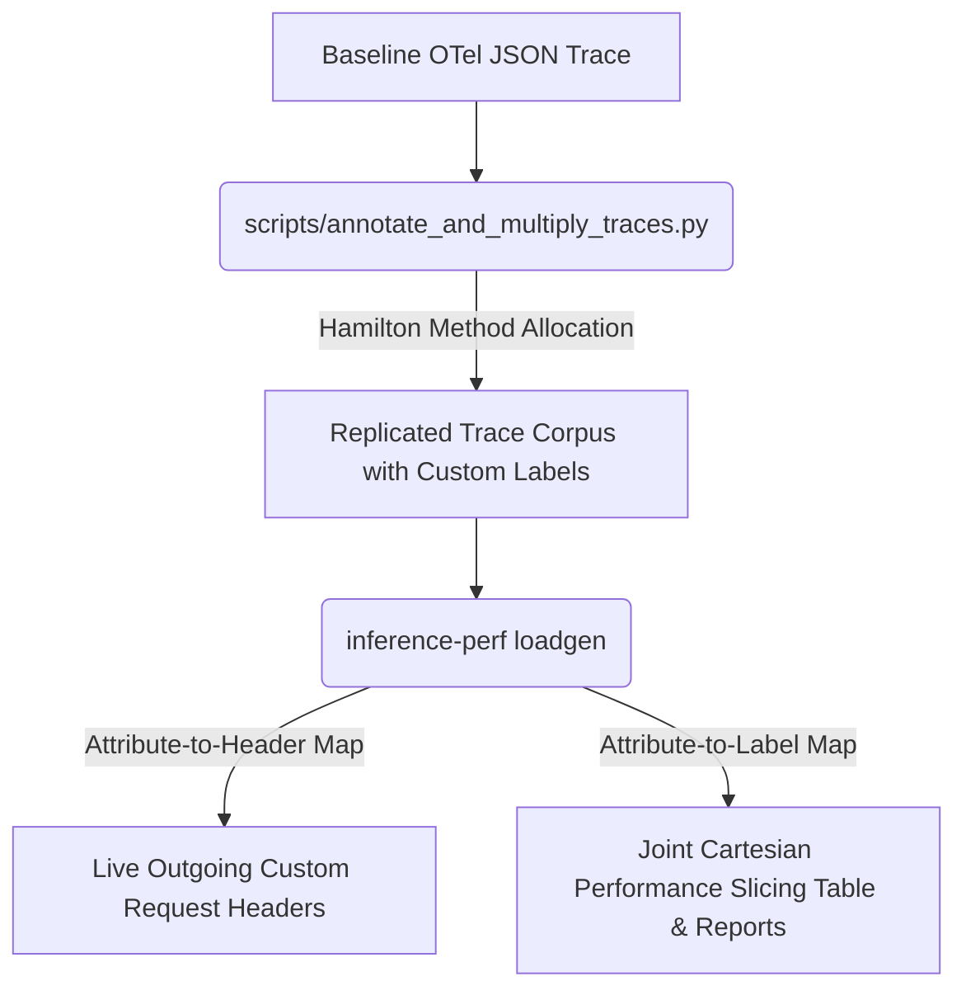

# Context-Aware Replay and Performance Slicing

This guide explains how to use context-aware load generation and multi-dimensional Cartesian slicing in `inference-perf`.

These features allow you to benchmark LLM serving engines under complex traffic mixtures by categorizing traffic with arbitrary metadata. You can:

* **Propagate session context** via outgoing HTTP headers.
* **Enforce per-request latency service level objectives (SLOs)**.
* **Slice performance metrics** across joint Cartesian label combinations (e.g., routing overheads, queueing policies, or priority isolation).

---

## Common Use Cases

While multi-tenant Quality of Service (QoS) is a primary application, the framework supports any session-level or request-level metadata attribute:

| Use Case | Example OTel Attribute | Example Custom HTTP Header | Example Slicing Dimensions | Analysis Goal |
| :--- | :--- | :--- | :--- | :--- |
| **QoS & Priority** | `priority` | `X-Inference-Priority` | `["priority", "tenant_id"]` | Verify performance isolation, queueing policies, and fairness. |
| **Geographic Routing** | `region` | `X-Client-Region` | `["region"]` | Measure regional routing latency penalties and SLA compliance. |
| **A/B Engine Routing** | `engine_model` | `X-Target-Engine` | `["engine_model", "experiment_group"]` | Compare latency profiles between distinct serving backends. |
| **Workload Profiling** | `task_category` | `X-Request-Category` | `["task_category", "input_len_bucket"]` | Benchmark serving efficiency across diverse prompt patterns. |

---

## Pipeline Architecture

The pipeline replicates baseline telemetry into synthetic load and generates multi-dimensional performance reports:



---

## Prerequisites

* **Python Version**: `>= 3.12` (defined in `pyproject.toml`).
* **Core Features**: Trace ingestion, synthetic generation, and Cartesian slicing are supported natively using the Python standard library (no external dependencies required).
* **OTel Telemetry Exporting (Optional)**: To export real-time benchmark spans to an external collector, set `OTEL_TRACES_ENABLED=true` and install the OTel extras:

  ```bash
  pip install "inference-perf[otel]"
  ```

---

## Core Concepts

`inference-perf` supports the following features to simulate production environments:

* **Session-Consistent Labeling**: Custom attributes (e.g., tenant ID, priority) are applied at the session (trace) level. All requests within a session share identical attributes, representing multi-turn conversations.
* **Context Propagation (Header Injection)**: Attributes are injected into outgoing HTTP headers, allowing downstream gateways or model servers to route or process traffic based on this context.
* **Dynamic SLO Overrides**: Per-request latency objectives (SLOs) can be passed via request headers. `inference-perf` evaluates request success and Goodput against these limits.
* **Cartesian Performance Slicing**: Performance metrics are aggregated and analyzed by joint combinations of mapped labels (e.g., `["priority", "tenant_id"]`).

### Acquiring Session Context

To use context-aware replay, your traces must contain custom attributes. You can acquire them in two ways:

#### 1. Synthetic Generation

Duplicate a baseline trace and inject custom attributes programmatically using the replicator script. This is the standard workflow for building benchmark suites. See [Synthetic Trace Replication and Annotation](./synthetic_trace_replication.md).

#### 2. Production Recording

Record custom metadata on spans in your application code using the OpenTelemetry SDK:

```python
from opentelemetry import trace

tracer = trace.get_tracer(__name__)
with tracer.start_as_current_span("inference_call") as span:
    span.set_attribute("tenant_id", "tenant-a")
    span.set_attribute("priority", "premium")
    # Execute inference...
```

`inference-perf` extracts these attributes during replaying using your configured mappings.

---

## Configuration Guide

Configure these features in your YAML benchmark configuration file:

### Mapping Trace Attributes

Under the `data` block (when using `type: otel_trace_replay`), map OTel span attributes to outgoing HTTP headers and internal reporting labels:

```yaml
data:
  type: otel_trace_replay
  otel_trace_replay:
    trace_directory: "/path/to/trace/corpus"
    # Map trace attributes to outgoing HTTP headers
    attribute_to_header_map:
      priority: "X-Inference-Priority"
      tenant_id: "X-Inference-Tenant-ID"

    # Map trace attributes to internal reporting labels
    attribute_to_label_map:
      priority: "priority"
      tenant_id: "tenant"
```

> **Note:** If a configured attribute is missing from a span, `inference-perf` falls back to `"default"` for both headers and labels.

### Alternative Trace Sources

You can specify explicit trace files (with wildcards) or stream datasets directly from Hugging Face:

#### Option A: Explicit File List (with Wildcards)

```yaml
data:
  type: otel_trace_replay
  otel_trace_replay:
    trace_files:
      - "/var/log/traces/session_123.json"
      - "/var/log/traces/agent_chain_*.json"  # Wildcard support
```

#### Option B: Streaming Hugging Face Datasets

```yaml
data:
  type: otel_trace_replay
  otel_trace_replay:
    hf_dataset_path: "Exgentic/agent-llm-traces"
```

> **Important:** Streamed Hugging Face datasets must contain `session_id` and a `spans` list of OTel span objects. Gated datasets require `HF_TOKEN` or running `huggingface-cli login`.

### Configuring Cartesian Slicing

Under the `report` block, specify the joint combinations of labels to slice metrics by:

```yaml
report:
  request_lifecycle:
    summary: true
    per_stage: true
    # Group metrics by joint combinations of priority and tenant labels
    group_by_labels:
      - ["priority", "tenant"]
```

### Dynamic SLO Overrides

You can override static Goodput latency constraints on a per-request basis. The load generator parses `x-slo-ttft-<unit>` and `x-slo-tpot-<unit>` headers to extract request-specific latency objectives.

To enable this, map the custom OTel span attributes containing your SLO values directly to the designated SLO header names:

```yaml
api:
  type: chat
  streaming: true
  slo_unit: "ms"                           # SLO header unit ("ms", "s", or "us")
  slo_ttft_header: "X-Inference-SLO-TTFT"  # Override default x-slo-ttft-ms
  slo_tpot_header: "X-Inference-SLO-TPOT"  # Override default x-slo-tpot-ms

data:
  type: otel_trace_replay
  otel_trace_replay:
    trace_directory: "/tmp/annotated_traces"
    attribute_to_header_map:
      target_ttft: "X-Inference-SLO-TTFT"
      target_tpot: "X-Inference-SLO-TPOT"
```

Goodput calculations assess each request against these dynamic limits, falling back to static thresholds in `report.goodput.constraints` if the headers are missing.

### Complete Configuration Example

A complete, ready-to-run version of this configuration is available at [context_aware_replay_example.yaml](../examples/otel/context_aware_replay_example.yaml).

```yaml
api:
  type: chat
  streaming: true

server:
  type: mock
  model_name: "mock-model"
  base_url: "http://localhost:8000"

tokenizer:
  pretrained_model_name_or_path: "gpt2"

data:
  type: otel_trace_replay
  otel_trace_replay:
    trace_directory: "/tmp/annotated_traces"
    attribute_to_header_map:
      priority: "X-Inference-Priority"
      tenant_id: "X-Inference-Tenant-ID"
    attribute_to_label_map:
      priority: "priority"
      tenant_id: "tenant"

load:
  type: trace_session_replay
  stages:
    - concurrent_sessions: 10
  worker_max_concurrency: 200

report:
  request_lifecycle:
    summary: true
    per_stage: true
    group_by_labels:
      - ["priority", "tenant"]
  goodput:
    constraints:
      ttft: 0.050  # TTFT must be under 50ms (0.050s)
      tpot: 0.020  # TPOT must be under 20ms (0.020s)
```

> **Tip:** The Goodput evaluator supports five performance metric keys (all in **seconds**):
>
> * `ttft`: Time To First Token (e.g., `0.050` for 50ms)
> * `tpot`: Time Per Output Token (e.g., `0.020` for 20ms)
> * `itl`: Inter-Token Latency
> * `ntpot`: Normalized Time Per Output Token (total latency / output token count)
> * `request_latency`: End-to-End Request Latency

### Running the Benchmark

Execute the load generator with your configuration file:

```bash
inference-perf -c /path/to/your/config.yaml
```

---

## Results and Sliced Reporting

After the replay completes, `inference-perf` aggregates and prints the results by joint Cartesian label combinations.

### Console Slices Summary

A summary table is printed to `stdout`:

```
                           Sliced Performance Summary
┏━━━━━━━━━━━━━━━━━━━━┳━━━━━━┳━━━━━┳━━━━━━━━━┳━━━━━━━━━━━┳━━━━━━━━━━┳━━━━━━━━━━━┓
┃ Labels             ┃ Reqs ┃ QPS ┃ Error % ┃ Mean TTFT ┃ P90 TTFT ┃ Goodput % ┃
┡━━━━━━━━━━━━━━━━━━━━╇━━━━━━╇━━━━━╇━━━━━━━━━╇━━━━━━━━━━━╇━━━━━━━━━━╇━━━━━━━━━━━┩
│ priority=standard, │   42 │ 1.8 │    0.0% │     45.0  │     52.3 │     95.2% │
│ tenant=tenant-b    │      │     │         │           │          │           │
│ priority=premium,  │   18 │ 0.8 │    0.0% │     12.5  │     15.0 │    100.0% │
│ tenant=tenant-a    │      │     │         │           │          │           │
└────────────────────┴──────┴─────┴─────────┴───────────┴──────────┴───────────┘
```

* **Labels**: Joint combination of labels for this slice. Sorted by request volume descending.
* **Reqs / QPS**: Total requests and queries per second achieved for this slice.
* **Error %**: Percentage of failed requests (non-200 responses, socket errors, or timeouts).
* **Mean / P90 TTFT**: Time To First Token in milliseconds.
* **Goodput %**: Percentage of successful requests that satisfied the Goodput constraints.

> **Note:** To prevent terminal clutter, display is limited to the top 15 slices.

### JSON Reports

`inference-perf` generates individual JSON report files for each Cartesian slice in your local storage path (configured via `storage.local_storage.path`, defaulting to `reports-<timestamp>/`):

```text
reports-20260601-060000/
├── summary_labels_premium_tenant-a_lifecycle_metrics.json
├── summary_labels_standard_tenant-b_lifecycle_metrics.json
```

These files contain detailed latency distributions, percentile buckets, and Goodput metrics for downstream analysis.

---

## Troubleshooting & Limitations

### 1. Predecessor Session Context Warnings

During replay, you may see this warning:

```text
WARNING  inference_perf.datagen.replay_graph_session_datagen - Event traceX:event_001: output segment from traceX:event_000 not available, using recorded content
```

> **Note:** In multi-turn sessions, the load generator dynamically substitutes the output of a predecessor turn into the prompt of the successor. If the predecessor turn yielded empty text (or in mock mode), the generator falls back to the static recorded content in the trace file. These warnings are safe to ignore.

### 2. Mock Client Performance Metrics

If you are validating in mock mode (`server.type: mock`):

> **Mock Mode Limitations:**
>
> * The mock client reports null values for token-level latency.
> * The console table displays `-` under **Mean TTFT** and **P90 TTFT**.
> * **Goodput %** defaults to `0.0%` because constraints cannot be evaluated against null latencies.
>
> Latency percentiles and Goodput calculations populate correctly when replaying against a live LLM engine.

---

## Advanced Workflows

To simulate complex, heterogeneous workloads where different slices run distinct prompt patterns (e.g., different tenants running different prompt lengths), see the **Heterogeneous Workload Shapes Workaround** in the [Synthetic Trace Replication and Annotation Guide](./synthetic_trace_replication.md#advanced-workflows-heterogeneous-workload-shapes-workaround).
